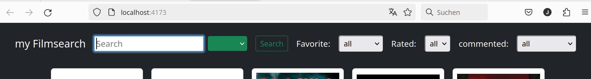

# myFilmSearch

User interface created in Vue 3 to search and show results from http://www.omdbapi.com/

> version: 1.1.1

> scope: training

> autor: AG



## Project Setup

```sh
pnpm install
```

## Project Config

### 1st step:

change file name <u>src/stores/storedData/config-example.json</u>
to src/stores/storedData/config.json
You can use bash command for both steps as below.

### 2nd step:

"OMDbApiAccessKey": "yourKey",
replace yourKey with your Key
thurder information http://www.omdbapi.com/

for linux/mac:

```sh
cp src/stores/storedData/config-example.json src/stores/storedData/config.json
nano src/stores/storedData/config.json
```

for windows:

```sh
rn src/stores/storedData/config-example.json src/stores/storedData/config.json
edit src/stores/storedData/config.json
```

### data model:

Description data model

```sh
    nano src/stores/storedData/filmInintStore.json
```
for windows:

```sh
    edit src/stores/storedData/filmInintStore.json
```
### Compile and Minify for Production

```sh
pnpm build
pnpm preview
```

Now you are up and running - Have fun!


### For deeper insigths 

```sh
pnpm dev
```
use devtools to view used components, data management and various graphs
